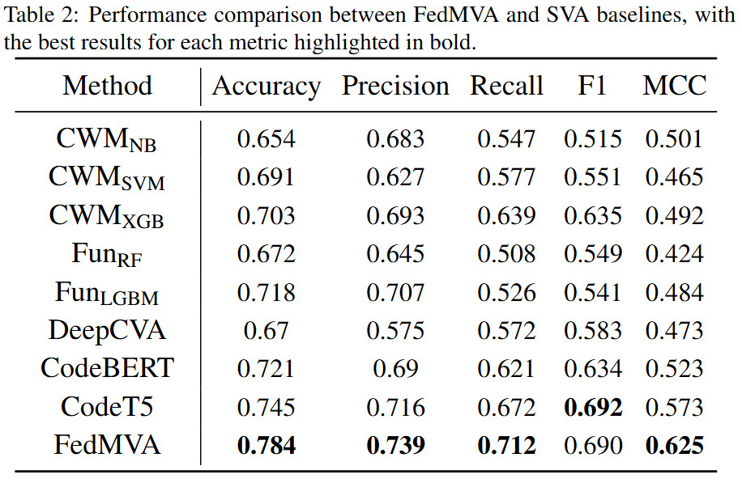
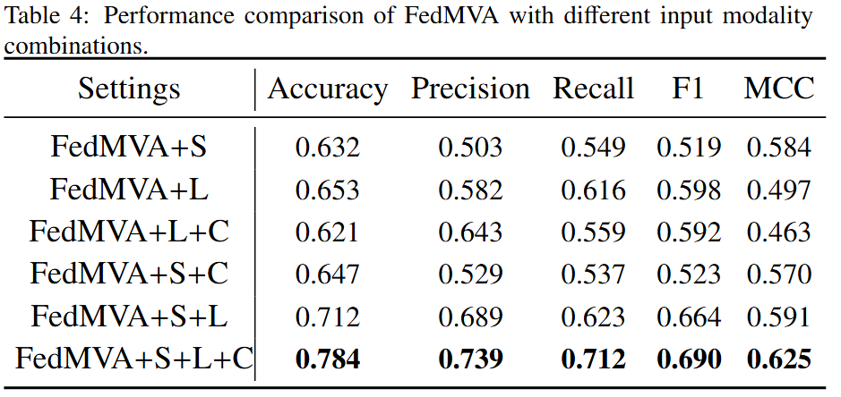
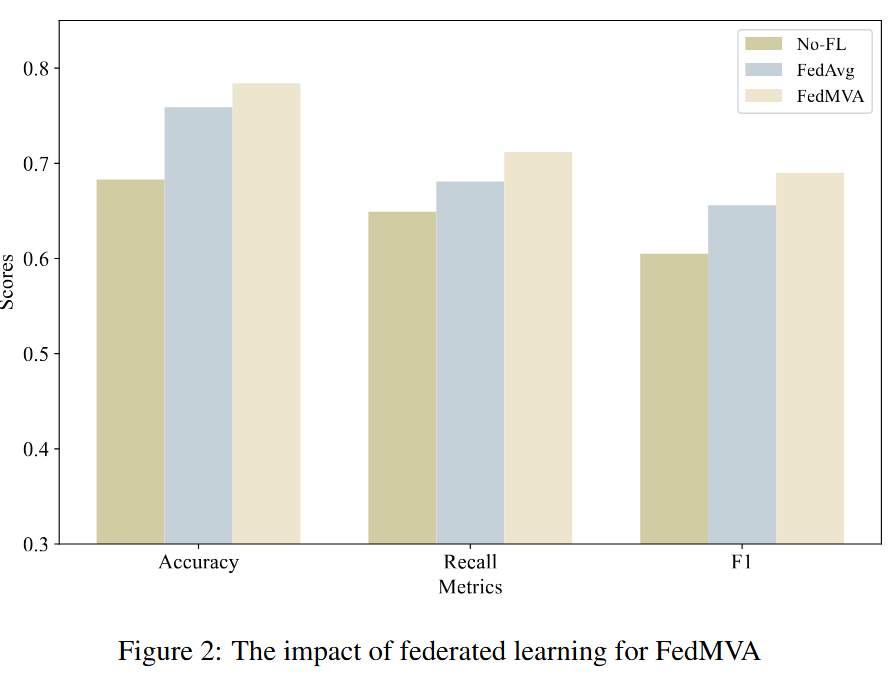
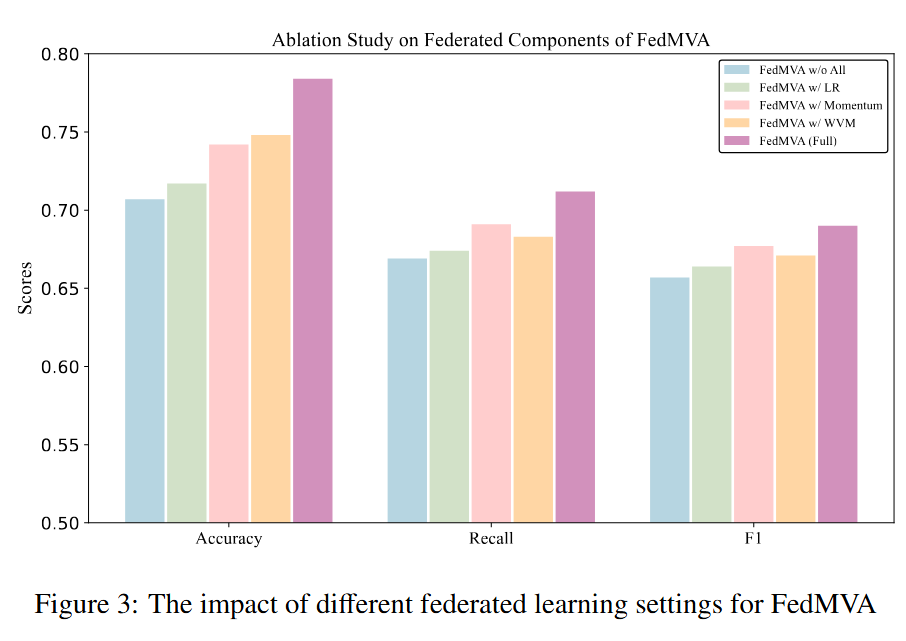
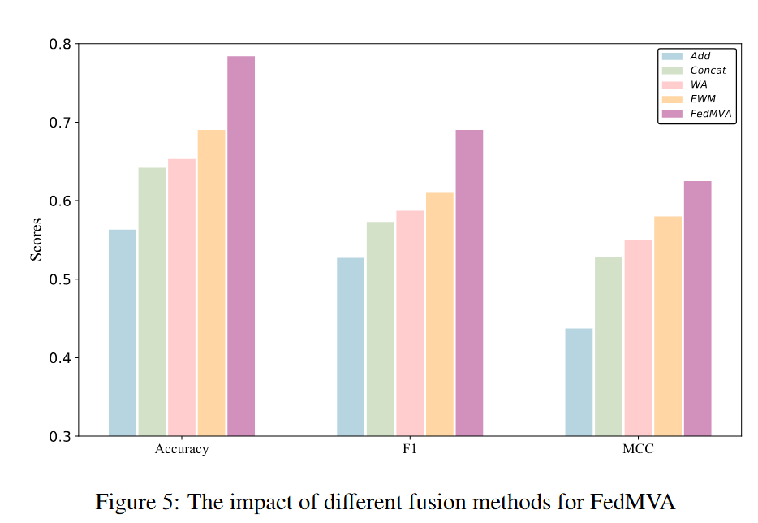

# FedMVA: Enhancing Software Vulnerability Assessment via Federated Multimodal Learning

This is the source code to the paper "DMVAF: A Decentralized Learning Framework for Multimodal Vulnerability Assessment". Please refer to the paper for the experimental details.

# Approach
"

# Data preprocessing
You can download the preprocessed dataset from [here](*https://drive.google.com/file/d/1gMUqkgg0JkfgC5EZFZWBSrcOXD2bvYKn/view?usp=sharing*) and move it to `data`.
If you would like to obtain more information about the dataset, please refer to `data/readme.md`.

### Requirements

Environment can be set up by running the following command in the root directory of the project:
``` conda env create -f environment.yaml ```

## About the experimental results in the paper:

We provide a brief analysis of RQ.

If you want to see more detail, please see the paper.

1. The purpose of RQ1 is to demonstrate the competitiveness of our proposed method DMVAF compared to current state-of-the-art SVA baselines.



2. In RQ2, our objective is to investigate whether this tri-modal input design achieves optimal performance for DMVAF. Additionally, we aim to compare different modality configurations to determine which input modality contributes most significantly to the performance of DMVAF.



3. In RQ3, we aim to evaluate the effectiveness of the decentralized learning framework in DMVAF through ablation studies.



4. This RQ is designed to analyze whether our personal adjustment can make DMVAF achieve the best performance.



5. In this RQ, we aim to explore the impact of the multi-modal fusion strategy on DMVAF’s performance and cross-modal interactions.


